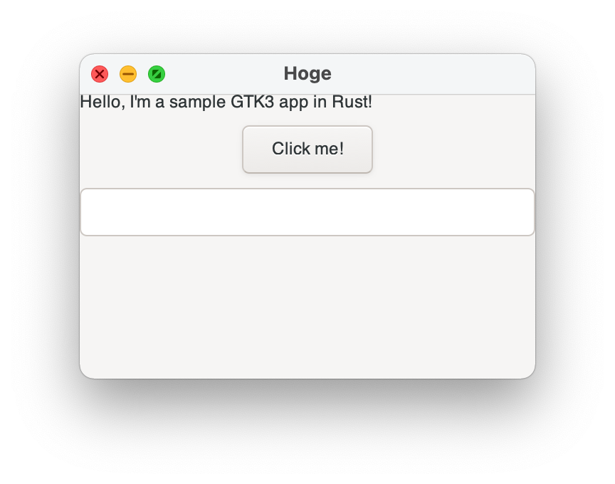

# Rust + GTK

## Note

* This is to build GTK3 app on Apple Silicon Mac, Intel Mac and Intel Windows
* GTK4 is not yet tested
* MacOS



* Windows


## How To Build

### MacOS

* It builds and runs successfully on both Apple Silicon or Intel CPUs
* Install GTK

```bash
brew install gtk+3
```

* Install Rust
* Build

```bash
cargo build
```

## Windows build on MacOS - incomplete (gtk build error)

* Intel Mac user can skip this step
  * This step is Apple Silicon Mac only

```bash
# install Intel homebrew in /usr/local/bin -> see the Homebrew official site

arch -x86_64 /usr/local/bin/brew install pkg-config gcc gtk+3
export PKG_CONFIG=/usr/local/bin/pkg-config
export PKG_CONFIG_PATH=/usr/local/lib/pkgconfig

cargo build --target

* Install GTK

```bash
arch -x86_64 /usr/local/bin/brew install gtk+3
# if you change PKG_CONFIG* env vars, reinstall gtk+3
```

* Build

```bash
arch -x86_64 rustup target add x86_64-pc-windows-gnu
cargo build --target x86_64-pc-windows-gnu

# it fails
error: failed to run custom build command for `gtk v0.9.2`

Caused by:
  process didn't exit successfully: `/Users/scott/Projects/NoBackup/rust/gtkspike/target/debug/build/gtk-05c7ad2c5f06caff/build-script-build` (exit code: 1)
  --- stdout
  TARGET = Some("x86_64-pc-windows-gnu")
  OPT_LEVEL = Some("0")
  HOST = Some("x86_64-apple-darwin")
  CC_x86_64-pc-windows-gnu = None
  CC_x86_64_pc_windows_gnu = None
  TARGET_CC = None
  CC = Some("clang")
  CFLAGS_x86_64-pc-windows-gnu = None
  CFLAGS_x86_64_pc_windows_gnu = None
  TARGET_CFLAGS = None
  CFLAGS = None
  CRATE_CC_NO_DEFAULTS = None
  DEBUG = Some("true")
  running: "clang" "-O0" "-ffunction-sections" "-fdata-sections" "-g" "-fno-omit-frame-pointer" "--target=x86_64-pc-windows-gnu" "-Wall" "-Wextra" "-o" "/path/tp/proj/target/x86_64-pc-windows-gnu/debug/build/gtk-bd540c0334f8d154/out/src/foreground.o" "-c" "src/foreground.m"
  cargo:warning=src/foreground.m:1:9: fatal error: 'AppKit/AppKit.h' file not found
  cargo:warning=#import <AppKit/AppKit.h>
  cargo:warning=        ^~~~~~~~~~~~~~~~~
  cargo:warning=1 error generated.
  exit code: 1

  --- stderr

```

### Windows

* Install Rust
* Install and configure `stable-x86_64-pc-windows-gnu` as the default Rust target

```bash
rustup target add stable-x86_64-pc-windows-gnu
rustup default stable-x86_64-pc-windows-gnu
```

* Install msys2
  * Follow <https://www.msys2.org/>
* [optional] Install mingw toolchain, basse-devel
* Install gcc and gdb in msys2

```bash
pacman -S mingw-w64-x86_64-toolchain base-devel
pacman -S mingw-w64-x86_64-gcc mingw-w64-x86_64-gdb
```

* Build

```bash
cargo build
```
